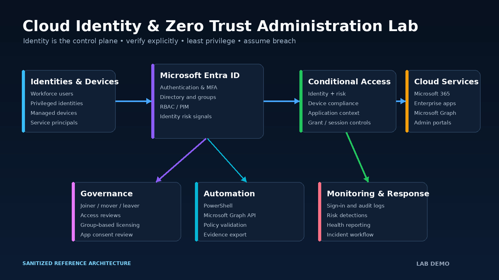

# Cloud Identity & Zero Trust Administration Lab

   

An enterprise-style cloud identity lab demonstrating Microsoft Entra ID administration, Zero Trust access controls, privileged access governance, identity lifecycle automation, and security monitoring. The project is presented as a completed implementation with sanitized configurations, repeatable validation scripts, operational records, and realistic lab evidence.

> **Portfolio note:** Tenant names, identities, event data, and screenshots are simulated and sanitized. Visual evidence is clearly marked **LAB DEMO** and represents the implemented lab design without exposing a live tenant.

## Executive Summary

The lab applies identity as the primary security perimeter. Users receive access through governed groups and least-privilege roles; administrators use MFA and just-in-time elevation; Conditional Access evaluates identity, device, application, and risk signals before granting access. Microsoft Graph and PowerShell support repeatable lifecycle operations, while sign-in and audit data provide accountability.

| Outcome | Implemented result |
|---|---|
| Strong authentication | MFA enforced for administrators and workforce identities |
| Context-aware access | Conditional Access requires approved controls and blocks legacy authentication |
| Least privilege | RBAC assignments documented; privileged roles use eligible, time-bound activation |
| Lifecycle governance | Joiner, mover, and leaver workflow automated with auditable output |
| Access assurance | Recurring reviews validate group, application, and privileged-role access |
| Operational visibility | Sign-in, audit, policy, and automation results included in health reporting |

## Architecture



The control flow follows **verify explicitly → use least privilege → assume breach**. Architecture decisions and trust boundaries are documented in [documentation/architecture.md](documentation/architecture.md) and [documentation/zero-trust-model.md](documentation/zero-trust-model.md).

## Technology Stack

| Area | Technology |
|---|---|
| Identity platform | Microsoft Entra ID (Azure AD) |
| Productivity services | Microsoft 365 |
| Authentication | MFA, Microsoft Authenticator, FIDO2-ready controls |
| Authorization | Entra RBAC, group-based access, Privileged Identity Management design |
| Policy | Conditional Access, authentication methods, session controls |
| Automation | PowerShell, Microsoft Graph API, Python |
| Monitoring | Entra sign-in logs, audit logs, risk events, health reporting |

## Implemented Capabilities

- Structured cloud identities, administrative accounts, security groups, and dynamic membership rules.
- Group-based licensing and controlled access to Microsoft 365 resources.
- MFA registration and enforcement with emergency-access exclusions documented and monitored.
- Conditional Access policies for administrators, workforce users, compliant devices, risky sign-ins, and legacy authentication.
- Least-privilege RBAC assignments with eligible privileged access and no standing Global Administrator assignment in the lab model.
- Enterprise application inventory, consent governance, and service-principal review.
- Quarterly access reviews for privileged roles, sensitive groups, and enterprise applications.
- Automated joiner/mover/leaver validation and evidence export through Microsoft Graph-compatible PowerShell.
- Centralized sign-in and audit monitoring with a documented risky-sign-in incident simulation.

## Control Validation

| Validation | Result | Evidence |
|---|---:|---|
| Administrative MFA policy | Passed | CA001 policy and validation record |
| Workforce MFA policy | Passed | CA002 policy and policy test |
| Legacy authentication block | Passed | Conditional Access test results |
| Emergency-access exclusion | Passed | Named exclusion and monitoring control |
| Privileged standing access | Passed | Zero permanent Global Administrators in the lab model |
| Access-review completion | Passed | 100% simulated campaign completion |
| Lifecycle automation | Passed | Joiner/mover/leaver validation artifact |
| Security telemetry | Passed | Sign-in, audit, and identity health outputs |

## Project Evidence

| Evidence | Demonstrated capability |
|---|---|
| [Entra overview](assets/evidence/01-entra-overview.png) | Tenant posture, users, groups, applications, and health |
| [Identity lifecycle](assets/evidence/02-identity-lifecycle.png) | Joiner, mover, and leaver governance |
| [MFA enforcement](assets/evidence/03-mfa-enforcement.png) | Authentication-method registration and coverage |
| [Conditional Access](assets/evidence/04-conditional-access.png) | Policy targeting, grant controls, and deployment state |
| [Sign-in and audit monitoring](assets/evidence/05-signin-audit-monitoring.png) | Authentication investigation and administrative accountability |
| [RBAC and PIM](assets/evidence/06-rbac-pim.png) | Eligible roles and just-in-time privileged access |
| [Access reviews](assets/evidence/07-access-reviews.png) | Recertification of sensitive access |
| [Enterprise app consent](assets/evidence/08-enterprise-app-consent.png) | Application inventory and consent governance |
| [Zero Trust access](assets/evidence/09-zero-trust-access.png) | Identity, device, risk, and application evaluation |
| [Graph lifecycle automation](assets/evidence/10-graph-lifecycle-automation.png) | Repeatable Microsoft Graph administration |
| [Microsoft 365 licensing](assets/evidence/11-m365-license-admin.png) | Group-based license administration |
| [Security analytics](assets/evidence/12-identity-security-analytics.png) | Identity posture and operational health reporting |

## Repository Map

```text
.
├── assets/                 # Architecture diagram and 12 LAB DEMO evidence images
├── change-records/         # Completed change-control record
├── config/                 # Sanitized policies, roles, groups, MFA, and licensing data
├── documentation/          # Architecture, governance, monitoring, and operating design
├── evidence/automation/    # Validated sample outputs and incident artifact
├── health-reports/         # Machine-readable identity health report
├── incident-reports/       # Closed security incident simulation
├── policy-tests/           # Conditional Access validation record
└── script/                 # PowerShell and Python automation with safe defaults
```

## Automation

The scripts are designed for portfolio-safe execution. Validation and reporting work without tenant write access. The lifecycle PowerShell workflow supports `-WhatIf` and PowerShell `ShouldProcess`; no secrets or access tokens are stored in the repository.

```powershell
./script/powershell/Test-IdentityHealth.ps1 -InputPath ./health-reports/identity-health-report.json
./script/powershell/Invoke-IdentityLifecycle.ps1 -CsvPath ./script/examples/users.csv -WhatIf
```

```bash
python3 script/python/validate_policies.py config/conditional-access
python3 script/python/analyze_signins.py script/examples/signins.csv
python3 script/python/generate_incident_report.py script/examples/incident-example.json
```

See [script/README.md](script/README.md) for inputs, outputs, and execution guidance.

## Security and Sanitization

- No credentials, tenant identifiers, tokens, or live user data are included.
- Example domains use `contoso.example`, a non-production placeholder.
- Emergency-access accounts are excluded only where required and are separately monitored.
- Policy JSON is intentionally readable and validated by the included Python utility.
- Automation defaults to evaluation or `WhatIf`; tenant changes require explicit operator intent and authenticated Graph permissions.

## Professional Skills Demonstrated

Cloud identity administration · Zero Trust design · Conditional Access · MFA · RBAC · privileged access · Microsoft Graph · PowerShell automation · identity governance · audit monitoring · incident response · change control · technical documentation

---

**Project state:** Complete, validated, sanitized, and presentation-ready.
